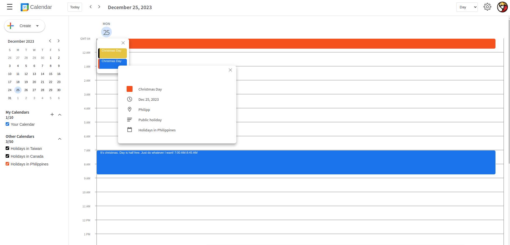

# Google Calendar Clone

Built with React + TypeScript

## Available Features

- [x] Calendar List
- [x] Mini Calendar
- [x] Schedule types: Event and Task
- [x] Calendar types: Day, Week, and last 4 days
- [ ] CRUD w/ Firebase
- [ ] Firebase Authentication with Google account
- [x] Draggable dialog w/ position readjustment
- [ ] Integrating Google Calendar Holiday Events to additional list of calendars
- [ ] Time Indication with a red line style

### Optional Configuration for .env Variables

**Client-side Configuration**

1. Create the following env files under /client: `.env` and `.env.development`
2. Define this variable `REACT_APP_HOLIDAY_API_URL` in each file accordingly.

_For example_:

```dotenv
REACT_APP_HOLIDAY_API_URL=https://your-holiday-api-url.com
```

3. Create the following .env variables under /server:

- `API_KEY`: Generate your API key [here](https://console.cloud.google.com/)
- `CALENDAR_REGION`: If you're unsure about the value to initialize, use the following value: `en.usa`. To find the available options, refer to the list of supported regions in the `/server/data/google-calendar-list.txt` file.
- `CALENDAR_ID`: By default, the value should be always `holiday@group.v.calendar.google.com`

_For example_

```dotenv
API_KEY=your-api-key
CALENDAR_REGION=en.usa
CALENDAR_ID=holiday@group.v.calendar.google.com
```

### Tools/Technologies/Libraries used

- React (Main UI Library)
- React Draggable
- React Select (UI library)
- Firebase (BaaS)
- Dayjs (Date and time API)
- Typescript (A superset lang of JS)
- Sass (Stylesheet Lanuage)

### Credits

- Thanks to [drewbot](https://github.com/drewbot/sass-flexbox-grid) for the sass flexbox grid stylesheet
- Thanks to [mattn](https://github.com/mattn) for the holiday events by region list

### Screenshots


